## 🗒 Notes system
Note system using [Golang](https://go.dev), [Python](https://www.python.org) and microservices architecture. The goal of the project is to develop a system for creating, storing notes and searching for notes.

## Overview
> [Features](#features)

> [Service Diagram](#service-diagram)

> [About](#about)

> [Technologies used](#technologies-used)

### Features
- 🔐 Authentication system: The user must sign in and sign up for using this app.
- 🗒 Notes creation with Markdown: User can create notes through the homepage. Viewing a note: User can view a note by clicking the note summary.
- 📂 File Upload and Download you can upload files to the note and download files from the note.
- 🔖 Tags they are needed to clearly describe your note
- 🗂️ Categories (User can create categories and add notes to categories)
- 🔎 Full-text Search: User can search for notes by title, content, tags and categories.

### Service Diagram
This is a service diagram. These are services planned to be implemented

### About
* A note is a summary of some material, such as a book, video, course, article, etc. A user can log in and create public notes and drafts.

* The advantage of this project is that a person studying some material reduces the time to create notes.

### Technologies used
| [Note Service](https://github.com/temirovazat/notes-system/tree/master/note_service) | [Category Service](https://github.com/temirovazat/notes-system/category_service) | [API Service](https://github.com/temirovazat/notes-system/api_service) | [Search Service](https://github.com/temirovazat/notes-system) | [File Service](https://github.com/temirovazat/notes-system/tree/master/file_service) | [User Service](https://github.com/temirovazat/notes-system/tree/master/user_service) | [Web Service]() |
| :-------------: | :-------------: | :-------------: | :-------------: | :-------------: | :-------------: | :-------------: |
|  |   |  |  |  |  |  |
|  |  |  |  |  |   |  |
|  |  |  |  | | | |
|  |  |  |  |  | |  |

### Implementation
* [x] Note Service
* [ ] Category Service
* [x] API Service
* [ ] Search Service
* [x] File Service
* [x] User Service
* [x] Tag Service
* [ ] Web Service
* [ ] Notification Service
* [ ] User Profile Service
* [ ] User Activity Service
* [ ] User Activity Service

## 🚀 Installation

### Prerequisites
* [Docker](https://www.docker.com/products/docker-desktop) - Docker is a set of platform as a service (PaaS) products that use OS-level virtualization to deliver software in packages called containers.
* [Docker Compose](https://docs.docker.com/compose/install/) - Docker Compose is a tool for defining and running multi-container Docker applications.
* [Python](https://www.python.org/downloads/) - Python is an interpreted, high-level and general-purpose programming language.
* [Golang](https://golang.org/dl/) - Go is an open source programming language that makes it easy to build simple, reliable, and efficient software.
* [NodeJS](https://nodejs.org/en/download/) - Node.js is an open-source, cross-platform, back-end JavaScript runtime environment that runs on the V8 engine and executes JavaScript code outside a web browser.
* [Yarn](https://classic.yarnpkg.com/en/docs/install/#windows-stable) - Yarn is a package manager that doubles down as project manager. Whether you work on one-shot projects or large monorepos, as a hobbyist or an enterprise user, we've got you covered.
